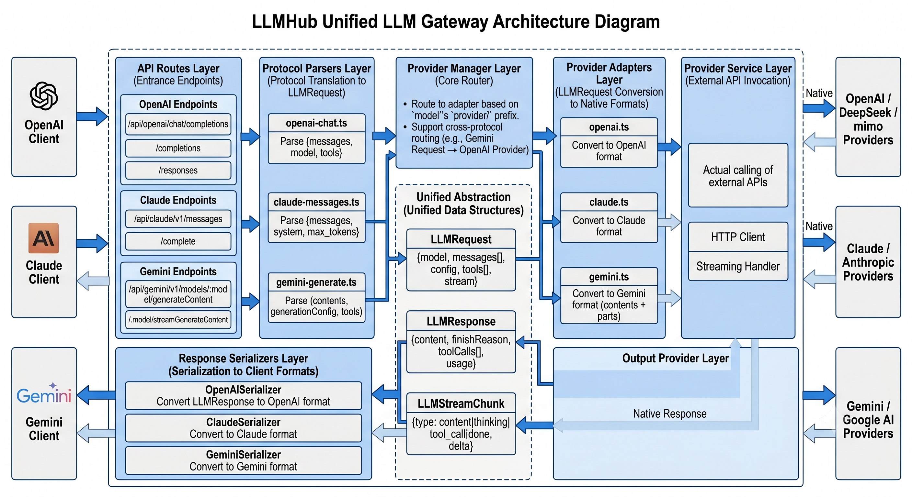

# LLMHub

A unified LLM gateway that aggregates multiple LLM providers behind OpenAI, Claude, and Gemini compatible API endpoints.

## Features

- **Triple Protocol Support**: Exposes OpenAI-compatible (`/api/openai/*`), Claude-compatible (`/api/claude/v1/*`), and Gemini-compatible (`/api/gemini/v1/*`) endpoints
- **Cross-Protocol Routing**: Call any provider through any protocol (e.g., use Gemini protocol to call OpenAI models)
- **Multi-Provider Aggregation**: Connect multiple LLM providers (OpenAI, Claude, Gemini, DeepSeek, etc.) through a single gateway
- **API Key Management**: Create and manage API keys with per-key rate limiting and model access control
- **Brute-Force Protection**: Configurable login protection with IP-based lockout
- **Usage Tracking**: Monitor API calls and token usage per key
- **Web Dashboard**: Manage providers, models, API keys, and security settings

## Quick Start

```bash
# Install dependencies
npm install

# Start development server
npm run dev
```

Open http://localhost:3000 and set up your admin password.

## Configuration

### Adding Providers

Navigate to **Providers** page to add your LLM providers:

| Field | Description |
|-------|-------------|
| Name | Unique identifier (e.g., `openai`, `deepseek`, `gemini`) |
| Protocol | `openai`, `claude`, or `gemini` |
| Base URL | Provider API endpoint |
| API Key | Your provider API key |

### Creating API Keys

Navigate to **API Keys** page to create keys for your applications:

- Set monthly token limits
- Restrict access to specific providers or models
- Track usage per key

## API Endpoints

### OpenAI Compatible

```
POST /api/openai/chat/completions
POST /api/openai/completions
POST /api/openai/responses
GET  /api/openai/models
```

### Claude Compatible

```
POST /api/claude/v1/messages
POST /api/claude/v1/complete
GET  /api/claude/v1/models
```

### Gemini Compatible

```
POST /api/gemini/v1/models/:model/generateContent
POST /api/gemini/v1/models/:model/streamGenerateContent
GET  /api/gemini/v1/models
```

### Usage Example

```bash
# OpenAI SDK
curl http://localhost:3000/api/openai/chat/completions \
  -H "Authorization: Bearer YOUR_API_KEY" \
  -H "Content-Type: application/json" \
  -d '{"model": "gpt-4", "messages": [{"role": "user", "content": "Hello"}]}'

# Claude SDK
curl http://localhost:3000/api/claude/v1/messages \
  -H "x-api-key: YOUR_API_KEY" \
  -H "Content-Type: application/json" \
  -d '{"model": "claude-3-sonnet-20240229", "max_tokens": 1024, "messages": [{"role": "user", "content": "Hello"}]}'

# Gemini SDK
curl http://localhost:3000/api/gemini/v1/models/gemini-2.5-flash:generateContent \
  -H "x-goog-api-key: YOUR_API_KEY" \
  -H "Content-Type: application/json" \
  -d '{"contents": [{"role": "user", "parts": [{"text": "Hello"}]}]}'
```

## Architecture

### Directory Structure

```
LLMHub/
├── pages/                    # Frontend (Vue 3)
│   ├── index.vue             #   Dashboard
│   ├── chat.vue              #   Chat playground
│   ├── models.vue            #   Model list
│   ├── providers.vue         #   Provider management
│   ├── api-keys.vue          #   API key management
│   ├── security.vue          #   Brute-force config
│   └── login.vue             #   Admin login
│
├── server/                   # Backend (Nitro)
│   ├── api/                  #   API routes
│   │   ├── auth/             #     Authentication
│   │   ├── hub/              #     Dashboard APIs
│   │   ├── openai/           #     OpenAI-compatible endpoints
│   │   ├── claude/v1/        #     Claude-compatible endpoints
│   │   └── gemini/v1/        #     Gemini-compatible endpoints
│   ├── protocols/            #   Request/response parsers & serializers
│   │   ├── openai-chat.ts    #     OpenAI Chat parser
│   │   ├── openai-chat-serializer.ts
│   │   ├── claude-messages.ts#     Claude Messages parser
│   │   ├── claude-messages-serializer.ts
│   │   ├── gemini-generate.ts#     Gemini GenerateContent parser
│   │   └── gemini-generate-serializer.ts
│   ├── providers/            #   Provider adapters
│   │   ├── loader.ts         #     Config & model loader
│   │   ├── manager.ts        #     Adapter manager & cross-protocol router
│   │   ├── openai.ts         #     OpenAI adapter
│   │   ├── claude.ts         #     Claude adapter
│   │   └── gemini.ts         #     Gemini adapter
│   ├── stores/               #   Data persistence
│   │   ├── auth.store.ts     #     Keys, sessions, brute-force
│   │   └── provider.store.ts #     Provider configs
│   └── middleware/           #   Auth middleware
│       ├── openai-auth.ts    #     Validate OpenAI API keys
│       ├── claude-auth.ts    #     Validate Claude API keys
│       ├── gemini-auth.ts    #     Validate Gemini API keys
│       └── hub-auth.ts       #     Validate admin session
│
└── .data/                    # Runtime storage (gitignored)
    ├── auth/                 #   Sessions, API keys, brute-force
    ├── providers/            #   Provider configs
    └── stats/                #   Usage counters
```

### Request Flow



### Unified Abstraction Layer

The core of LLMHub is the **unified abstraction** defined in `server/core/types.ts`:

```typescript
// Unified request - all protocols parse into this
interface LLMRequest {
  model?: string
  messages: Message[]
  config: GenerateConfig
  tools?: Tool[]
  stream?: boolean
}

// Unified response - all providers return this
interface LLMResponse {
  content: Content
  finishReason: 'stop' | 'length' | 'tool_calls' | 'error'
  toolCalls?: ToolCall[]
  usage: Usage
}

// Unified stream chunk
interface LLMStreamChunk {
  type: 'content' | 'thinking' | 'tool_call' | 'done' | 'error'
  delta?: string
  toolCall?: ToolCallDelta
}
```

**Flow Summary**:
1. **Parse**: Protocol-specific request → `LLMRequest` (e.g., `openai-chat.ts` parses OpenAI format, `gemini-generate.ts` parses Gemini format)
2. **Route**: Provider Manager resolves `model` → `ProviderAdapter` (supports cross-protocol routing)
3. **Transform**: Adapter converts `LLMRequest` → provider-native request
4. **Call**: Adapter sends request to LLM provider
5. **Normalize**: Adapter converts provider response → `LLMResponse` / `LLMStreamChunk`
6. **Serialize**: Protocol serializer converts `LLMResponse` → client-expected format

### Key Design Decisions

1. **Triple Protocol Gateway**: Single backend serves OpenAI, Claude, and Gemini clients, allowing seamless migration between SDKs
2. **Cross-Protocol Routing**: Any protocol endpoint can route to any provider (e.g., Gemini protocol → OpenAI provider)
3. **Adapter Pattern**: Each provider has an adapter that converts unified requests to native format, making it easy to add new providers
4. **File-Based Storage**: No database required; all data persisted to `.data/` directory using Nitro's FS driver
5. **Model Name Format**: Models are namespaced as `provider/model-id` (e.g., `openai/gpt-4`, `deepseek/deepseek-chat`, `gemini/gemini-2.5-flash`)

## Tech Stack

- **Framework**: Nuxt 3 (Vue 3 + Nitro)
- **Language**: TypeScript
- **UI**: Nuxt UI + Tailwind CSS
- **Storage**: File-based (Nitro FS driver)

## License

MIT
